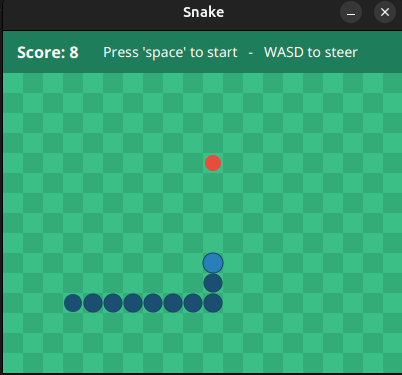

# Snake (JavaFX)

A classic Snake game built in Java with JavaFX. The snake moves continuously around a grid; steer it into the food to grow and score, and avoid running into the walls or your own body.



This started as a university Object Orientation assignment and was then extended into a small, self-contained game. The project keeps a clean separation between the game logic, the rendering, and the input handling.

## Features

- Smooth grid-based movement driven by a JavaFX `Timeline`.
- Grow when you eat; the body follows the head around corners correctly.
- The food never spawns on top of the snake.
- No accidental 180° reversals into your own neck.
- Collision detection that stops the snake just before it hits itself, so the head stays visible.
- Pause/resume, and restart after game over.
- Click anywhere on the board to move the food to that cell.

## Controls

| Key | Action |
|---|---|
| `W` `A` `S` `D` | Steer up / left / down / right |
| `Space` | Start / pause |
| `R` | Restart |
| Mouse click | Move the food to the clicked cell |

## Build and Run

Requires a JDK (17 recommended). JavaFX is pulled in automatically by the Gradle build, so there is nothing extra to install.

```bash
./gradlew run
```

On Windows:

```bash
gradlew.bat run
```

## How It Works

The code is organised so that the game logic never touches JavaFX:

- **Game logic** — `World`, `Head`, `BodySegment`, `TailSegment`, `Food`, and the `Actor`/`Mover`/`Segment` base classes hold the state and rules. The snake is a linked chain of segments; each step moves the head and the body follows.
- **Rendering** — `WorldView` is a JavaFX `Pane` that draws the board, snake, and food, and keeps each shape's position bound to the matching game object's coordinates via JavaFX property bindings. When the snake grows, an observer on the head's body property draws the new segment.
- **Input and app shell** — `Main` sets up the window, the game loop, and the keyboard/mouse handlers, and shows the score and status.

This separation means the game could be re-skinned or moved to a different UI toolkit by changing only `WorldView` and `Main`.

## Credits

The class structure and the project skeleton come from the Object Orientation course at Radboud University. The game logic, the gameplay features listed above, and the visual styling are my own work.
